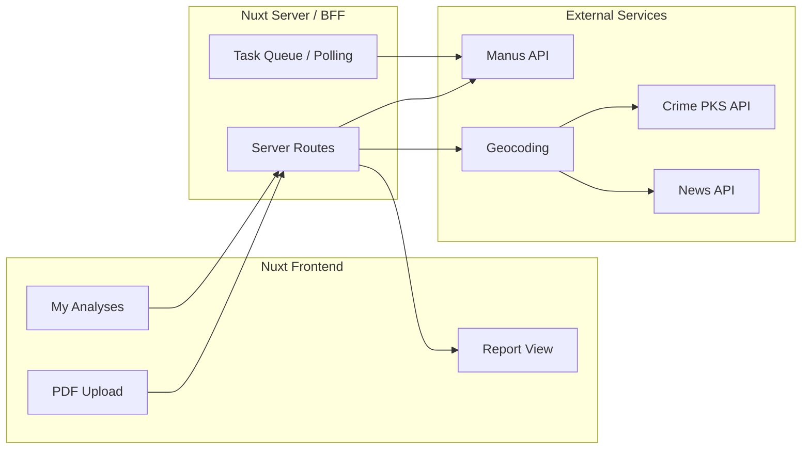

# DealVertical AI

Real estate Exposé analysis SaaS for the **Cursor AI Hackathon Hamburg 2026**.

Private investors upload German Exposé PDFs and receive institutional-style reports: financial analysis, pros/cons, and neighborhood intel (crime stats + local news).

---

# Implementation Plan

## Product summary

**DealVertical AI**: Private investors upload an Exposé PDF (address, text, images). The app returns a single report with (1) financial summary and pros/cons (institutional-style), and (2) neighborhood intel: crime statistics and local news (positive/negative, e.g. new school, missing persons, incidents). Scope is focused on the minimum set of features that deliver this value.

---

## High-level architecture

- **Frontend**: Nuxt 3 app, one main flow: upload → status → report.
- **Backend**: Nuxt server routes (and optional Nitro tasks) for upload, orchestration, and persistence.
- **External**: Manus (PDF analysis), geocoding, crime API, news API.



---

## Tool choices and roles

| Need | Choice | Role |
|------|--------|------|
| **PDF analysis** | Manus.im API | Upload PDF via Files API, create Task with real-estate prompt (financials, pros/cons). Webhooks or polling. [Manus API](https://open.manus.im/docs) |
| **UI design** | v0.app | Reference layouts; reimplement in Nuxt 3 with **shadcn-vue** + Tailwind via [shadcn-nuxt](https://nuxt.com/modules/shadcn) |
| **Geocoding** | Nominatim (OSM) or Google Geocoding | Address → lat/lng and region/city |
| **Crime / safety** | GovData / regional PKS | Police crime statistics by region for neighborhood section |
| **Local news** | NewsAPI or NewsCatcher | `country=de` + city/region keywords; positive/negative headlines |
| **Auth** | NuxtAuth (Auth.js) or Supabase Auth | Email/password or magic link |
| **Data persistence** | SQLite or Supabase | Users, analyses (address, Manus task id, resultJson, neighborhoodJson, PDF ref) |
| **File storage** | Local disk or Vercel Blob / R2 | Uploaded PDFs and cached report JSON |

---

## Data flow (MVP)

1. **Upload** – User uploads PDF (e.g. max 10 MB). Optional: user confirms/corrects address.
2. **Extract address** – User-entered or from Manus; MVP can start with manual address.
3. **Financial + pros/cons (Manus)** – Upload PDF to Manus Files, create Task with Exposé-analysis prompt; store result via webhook/polling.
4. **Neighborhood intel** – Geocode address → call crime API + news API; store in `neighborhoodJson`.
5. **Report** – Single page: financials, pros/cons, neighborhood (crime + news).

---

## Scope: in vs out (MVP)

**In scope:** Auth, PDF upload/validation/storage, “Run analysis” (Manus + neighborhood), report view, “My analyses” list, address for geocoding.

**Out of scope for MVP:** Payments, team workspaces, multi-property comparison, in-app edit of AI output, native mobile app.

---

## Repo structure (Nuxt)

- `app/` – `pages/` (dashboard, upload, report `[id]`), `components/`
- `server/api/` – `upload.post.ts`, `analyses/[id].get.ts`, `analyses/[id]/run.post.ts`, `webhooks/manus.post.ts`
- `server/utils/` – Manus client, geocode, crime API, news API
- `server/db/` or Prisma – User, Analysis (userId, address, filePath, manusTaskId, resultJson, neighborhoodJson, status, createdAt)
- Env: `MANUS_API_KEY`, `NEWS_API_KEY`, geocoding key, crime API URL

---

## Implementation order

1. Nuxt 3 + shadcn-vue + Tailwind + auth + DB  
2. Upload + storage, Analysis model  
3. Manus integration (files + tasks, webhook/polling)  
4. Report UI (financials, pros/cons, neighborhood)  
5. Neighborhood pipeline (geocode, crime, news)  
6. Dashboard (“My analyses” list)  
7. Polish (loading, errors, validation)

---

## Getting started

```bash
# Install dependencies
npm install

# Setup env (copy .env.example and add keys)
cp .env.example .env
# Edit .env: set NUXT_MANUS_API_KEY (Manus API), NUXT_NEWS_API_KEY (NewsAPI) for full features.

# Dev (creates data/ and SQLite DB on first run)
npm run dev
```

- **Manus API**: Get key at [open.manus.im](https://open.manus.im/docs); used for PDF analysis (financials, pros/cons).
- **NewsAPI**: Get key at [newsapi.org](https://newsapi.org); used for local news in the neighborhood section.
- Without keys, upload and list work; run analysis will fail until `NUXT_MANUS_API_KEY` is set.
